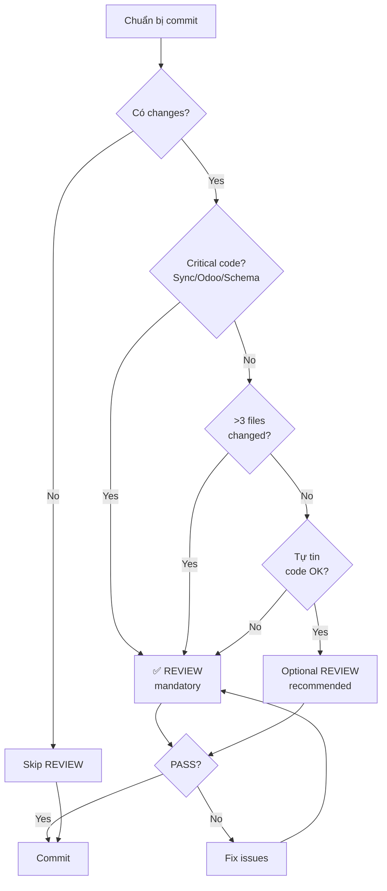

# REVIEW Workflow - Pre-commit Code Review Pattern

> **Dành cho:** opencode Agent (dùng `task` tool + subagent `reviewer`)
> **Version:** 2.0
> **Updated:** 2026-08-08
> **Migrated from:** Zed `spawn_agent` → opencode `task` tool (xem `.agents/rules/00-opencode-agent-system.md`)

---

## 🎯 Mục đích

REVIEW workflow giúp **kiểm tra git diff trước khi commit** theo rules trong `.agents/` và `.cursor/rules/`. Subagent REVIEW **chỉ đọc và báo cáo**, KHÔNG sửa file.

**Lợi ích:**
- Catch bugs/violations trước khi push lên GitHub
- Đảm bảo code align với AGENTS.md rules
- Fresh perspective (reviewer không có bias của implementer)

**Khác với Cline:** Zed không có git hooks, nên REVIEW là **manual trigger** thay vì bắt buộc. Main agent nên tự động gọi REVIEW trước mọi commit.

---

## ⚡ Khi nào BẮT BUỘC dùng REVIEW

**Trigger tự động:**

### 1. TRƯỚC MỌI git commit
- Main agent đã implement xong feature/fix
- Có changes chưa commit (staged hoặc unstaged)
- Chuẩn bị commit → gọi REVIEW trước

### 2. Sau khi fix critical code
- Sync logic, Odoo API calls
- Isar schema migration
- Security-sensitive code (auth, credentials...)

### 3. Trước khi tạo PR
- Review toàn bộ changes trong branch
- Đảm bảo không có blocker violations

**❌ KHÔNG cần REVIEW khi:**
- Không có changes (git diff rỗng)
- Chỉ update docs (.md files, không có code)
- Đã review rồi và chưa có changes mới

---

## 📋 REVIEW Workflow Steps

### Step 1: Main agent chuẩn bị commit

```markdown
Main agent: "Đã implement xong FsmRecurring + FsmFrequencySet models"
→ Check git status: có staged/unstaged changes
→ "Cần REVIEW trước khi commit"
```

### Step 2: Spawn REVIEW subagent

**Gọi `task` tool với `subagent_type: "reviewer"`.**

**Template prompt:**

```
Role: REVIEW

Mission: Review git diff chưa commit trong repo fieldforcemoblie theo rules trong:
- .agents/AGENTS.md
- .cursor/rules/*.mdc
- Project conventions (Dart 3, Flutter, Isar, Odoo)

TUYỆT ĐỐI KHÔNG sửa, tạo, hay xóa file.

Steps:
1. Run `git --no-pager diff` (unstaged changes)
2. Run `git --no-pager diff --cached` (staged changes)
3. Review từng file change theo rules

Output format (REQUIRED):

---
## REVIEW REPORT

### ISSUES FOUND

| SEVERITY | FILE:LINE | ISSUE | FIX |
|----------|-----------|-------|-----|
| [level] | [path:line] | [description] | [how to fix] |

SEVERITY levels:
- BLOCKER: Vi phạm nghiêm trọng (rò secret, xóa data, sync broken) → KHÔNG được commit
- HIGH: Vi phạm rule bắt buộc (.agents/AGENTS.md, .cursor/rules) → KHÔNG được commit  
- MEDIUM: Nên sửa nhưng không chặn commit
- LOW: Gợi ý cải thiện

### CONCLUSION

[Một trong hai:]
- ✅ REVIEW: PASS (no BLOCKER/HIGH issues)
- ❌ REVIEW: FAIL (found [N] BLOCKER/HIGH issues — FIX before commit)

---

Focus areas:
- AGENTS.md violations (naming, architecture, error handling...)
- Dart/Flutter best practices
- Isar model issues (missing @Index, wrong types...)
- Odoo API patterns (null/false handling, sync logic...)
- Security (secrets in code, SQL injection...)
- Testing (bỏ tests, mock data issues...)
```

### Step 3: Main agent xử lý kết quả

**Case A: REVIEW PASS**
```markdown
REVIEW subagent: "✅ REVIEW: PASS"
→ Main agent: "OK, commit ngay"
git add . && git commit -m "feat: add recurring models"
```

**Case B: REVIEW FAIL**
```markdown
REVIEW subagent: "❌ REVIEW: FAIL — 2 HIGH issues"

| SEVERITY | FILE:LINE | ISSUE | FIX |
|----------|-----------|-------|-----|
| HIGH | fsm_recurring.dart:45 | Missing @Index(unique: true) on odooId | Add @Index(unique: true) before late int odooId |
| HIGH | main.dart:55 | Forgot to add FsmRecurringSchema to init() | Add FsmRecurringSchema to schemas list |

→ Main agent: "Fix 2 issues"
[sửa code]
→ Main agent: "Chạy REVIEW lại"
[spawn REVIEW again]
→ REVIEW: "✅ PASS"
→ Commit
```

---

## 🎭 Chi tiết REVIEW subagent role

### Goal
Catch violations trước khi commit, KHÔNG sửa code

### Style
Strict, objective (như code reviewer khắt khe)

### Tools
1. `terminal` — git diff, git diff --cached
2. `read_file` — đọc rules files (.agents/AGENTS.md, .cursor/rules/*.mdc)
3. `grep` — tìm patterns vi phạm

### Output structure (BẮT BUỘC)

**Table format:**
```
| SEVERITY | FILE:LINE | ISSUE | FIX |
```

**Conclusion format:**
```
✅ REVIEW: PASS
hoặc
❌ REVIEW: FAIL — [N] BLOCKER/HIGH issues
```

---

## 🚨 SEVERITY levels chi tiết

### BLOCKER (chặn cứng, KHÔNG được commit)
- Rò rỉ secrets (.env values, credentials hardcoded)
- Xóa data logic (DROP TABLE, delete without WHERE...)
- Sync broken (Odoo API calls sai, conflict resolution bỏ qua)
- Security holes (SQL injection, XSS, auth bypass...)

**Ví dụ:**
```dart
// BLOCKER: Hardcoded password
final password = 'admin123'; // ← báo BLOCKER
```

### HIGH (vi phạm rule bắt buộc, KHÔNG được commit)
- AGENTS.md §X violations (naming, architecture, imports...)
- .cursor/rules violations (model structure, sync pattern...)
- Missing critical fields (Isar @Index, isPendingSync...)
- Import wrong (feature A import từ feature B trực tiếp)

**Ví dụ:**
```dart
// HIGH: Missing @Index(unique: true) on odooId (AGENTS.md §6)
late int odooId; // ← báo HIGH, phải có @Index(unique: true)
```

### MEDIUM (nên sửa, không chặn)
- Code smells (long method, duplicated code...)
- Missing docs (public API không có comment)
- Performance concerns (N+1 queries...)
- Inconsistent naming (camelCase vs snake_case...)

### LOW (gợi ý cải thiện)
- Refactor opportunities
- Better abstractions
- Test coverage suggestions

---

## 💡 Best Practices

### 1. REVIEW sau mỗi implementation phase

```markdown
✅ ĐÚNG:
- Implement feature A → REVIEW → commit
- Implement feature B → REVIEW → commit

❌ SAI:
- Implement A, B, C, D... → REVIEW 1 lần cuối
→ Quá nhiều changes, khó review, dễ miss issues
```

### 2. Fix ALL BLOCKER/HIGH trước khi commit

```markdown
❌ SAI: "Có 1 HIGH issue nhưng không quan trọng lắm, commit luôn"
→ Tích lũy tech debt

✅ ĐÚNG: Fix → REVIEW lại → PASS → commit
```

### 3. MEDIUM/LOW có thể defer

```markdown
REVIEW: "1 BLOCKER, 3 HIGH, 5 MEDIUM, 2 LOW"
→ Fix BLOCKER + HIGH → PASS → commit
→ MEDIUM/LOW: tạo TODO comment hoặc issue riêng
```

### 4. REVIEW chỉ check changes, không audit toàn bộ codebase

```markdown
✅ ĐÚNG: Review git diff (files thay đổi trong commit này)
❌ SAI: Audit toàn bộ project tìm bugs cũ
→ Out of scope, lãng phí thời gian
```

---

## ✅ Ví dụ thực tế

### Case 1: Review CP1 recurring models

**Main agent:**
```
Đã implement FsmRecurring + FsmFrequencySet
git status: 2 new files, 2 modified
→ Spawn REVIEW
```

**REVIEW output:**
```
## REVIEW REPORT

### ISSUES FOUND

| SEVERITY | FILE:LINE | ISSUE | FIX |
|----------|-----------|-------|-----|
| HIGH | fsm_recurring.dart:10 | Missing @Index(unique: true) on odooId | Add @Index(unique: true) late int odooId; |
| HIGH | main.dart:53 | Forgot FsmRecurringSchema | Add to init([...FsmRecurringSchema...]) |
| MEDIUM | fsm_frequency_set.dart:35 | fromJson() không handle exception | Wrap try-catch cho DateTime.parse() |
| LOW | fsm_recurring.dart:25 | Variable name `orderTemplateId` có thể rõ hơn | Consider `templateOrderId` for clarity |

### CONCLUSION

❌ REVIEW: FAIL — 2 HIGH issues (fix before commit)
```

**Main agent:**
```
Fix 2 HIGH issues:
1. Add @Index(unique: true) to fsm_recurring.dart:10
2. Add FsmRecurringSchema to main.dart:53

→ Spawn REVIEW again
```

**REVIEW output (lần 2):**
```
## REVIEW REPORT

### ISSUES FOUND

| SEVERITY | FILE:LINE | ISSUE | FIX |
|----------|-----------|-------|-----|
| MEDIUM | fsm_frequency_set.dart:35 | fromJson() không handle exception | Wrap try-catch cho DateTime.parse() |
| LOW | fsm_recurring.dart:25 | Variable name `orderTemplateId` có thể rõ hơn | Consider `templateOrderId` |

### CONCLUSION

✅ REVIEW: PASS (2 MEDIUM/LOW issues — can commit, fix later)
```

**Main agent:**
```
PASS → commit
git add . && git commit -m "feat: add recurring models (CP1)"
```

---

### Case 2: Review với BLOCKER

**Main agent:**
```
Fix auth bug, thêm debug logging
→ REVIEW
```

**REVIEW output:**
```
## REVIEW REPORT

### ISSUES FOUND

| SEVERITY | FILE:LINE | ISSUE | FIX |
|----------|-----------|-------|-----|
| BLOCKER | auth_service.dart:45 | Hardcoded password in log | Remove print('password: $password') |
| HIGH | auth_service.dart:67 | No error handling for authenticate() | Wrap try-catch |

### CONCLUSION

❌ REVIEW: FAIL — 1 BLOCKER, 1 HIGH (MUST FIX)
```

**Main agent:**
```
BLOCKER! Fix ngay:
1. Remove password logging
2. Add error handling

→ REVIEW lại → PASS → commit
```

---

## 🚨 Khi REVIEW fail hoặc sai

### 1. Subagent timeout
→ Main agent tự review: đọc git diff, check rules, tự đánh giá

### 2. False positive (báo HIGH nhưng thực tế OK)
→ Main agent verify bằng cách đọc rules: "Rule X không áp dụng vì..."
→ Ignore false positive, commit

### 3. REVIEW miss critical issue
→ Bài học: REVIEW không thay thế manual review của developer
→ Main agent vẫn phải có sense để catch obvious issues

---

## 📊 REVIEW vs Manual - Decision Tree



---

## 🔗 Kết hợp với workflows khác

### SCOUT → Implement → REVIEW → Commit

```markdown
1. SCOUT: Research orders feature
2. Main agent implement recurring models
3. REVIEW: Check git diff → PASS
4. Commit
```

### THINK → Implement → REVIEW → Commit

```markdown
1. THINK: 3 debaters chốt FINAL PLAN
2. Main agent implement theo plan
3. REVIEW: Check violations → FAIL (1 HIGH)
4. Fix HIGH issue
5. REVIEW again → PASS
6. Commit
```

### REVIEW → Fix → REVIEW loop (khi có nhiều issues)

```markdown
Implement → REVIEW → FAIL (5 HIGH)
→ Fix 5 issues → REVIEW → FAIL (2 HIGH còn lại)
→ Fix 2 issues → REVIEW → PASS
→ Commit
```

---

## 📝 Checklist trước khi commit

Main agent tự hỏi:

- [ ] Có staged/unstaged changes?
- [ ] Code này critical (sync/Odoo/schema/security)?
- [ ] Đã run tests (nếu có)?
- [ ] Đã self-review git diff?
- [ ] Spawn REVIEW subagent?
- [ ] REVIEW PASS?

**Nếu tất cả ✅ → Commit an toàn**

---

## 🎓 Training cho Main Agent

**Mục tiêu:** Main agent tự động gọi REVIEW mà không cần user nhắc

**Pattern recognition:**
```markdown
User: "Xong rồi, commit đi"
→ Main agent: "Trước khi commit, tôi sẽ chạy REVIEW workflow"
→ Spawn REVIEW
→ [xử lý kết quả]
→ Commit (nếu PASS)
```

**Auto-trigger phrases:**
- "commit", "push", "done", "xong"
- "tạo PR", "pull request"
- "deploy", "release"

→ Main agent: Check git status → nếu có changes → REVIEW → commit

---

## 🔐 Security Focus Areas (BLOCKER priority)

REVIEW subagent phải đặc biệt chú ý:

### 1. Credentials exposure
```dart
// BLOCKER
const apiKey = 'sk_live_xxxx'; // ← hardcoded
print('Password: $password'); // ← logging sensitive data
```

### 2. SQL injection (nếu có raw SQL)
```dart
// BLOCKER
db.rawQuery('SELECT * FROM users WHERE id = $userId'); // ← injection risk
```

### 3. Odoo API security
```dart
// HIGH
await odoo.callKw(model: 'res.users', method: 'write', ...); // ← write to users table
```

### 4. File system access
```dart
// HIGH
File('/etc/passwd').readAsString(); // ← access sensitive system file
```

---

## 📚 References

- **AGENTS.md**: Project conventions (naming, architecture, error handling...)
- **.cursor/rules/*.mdc**: Specific rules (Flutter models, Isar patterns, Odoo API...)
- **Dart Style Guide**: https://dart.dev/guides/language/effective-dart/style
- **Flutter Best Practices**: https://docs.flutter.dev/development/data-and-backend/state-mgmt/options

---

## 💬 Example REVIEW prompts

### Minimal prompt (quick review)
```
Role: REVIEW
Mission: Review git diff, report BLOCKER/HIGH issues only
Output: Table format + PASS/FAIL conclusion
```

### Detailed prompt (thorough review)
```
Role: REVIEW
Mission: Review all changes against .agents/AGENTS.md and .cursor/rules/
Focus: Security, architecture violations, Odoo/Isar patterns
Output: Full table (BLOCKER/HIGH/MEDIUM/LOW) + PASS/FAIL + suggestions
```

### Post-fix review
```
Role: REVIEW
Mission: Verify previous HIGH issues are fixed
Previous issues: [paste issues from last REVIEW]
Output: Confirm each fix + final PASS/FAIL
```
