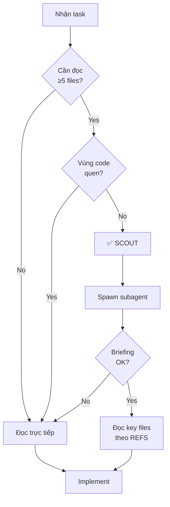

# SCOUT Workflow - Codebase Research Pattern

> **Dành cho:** opencode Agent (dùng `task` tool + subagent `scout`)
> **Version:** 2.0
> **Updated:** 2026-08-08
> **Migrated from:** Zed `spawn_agent` → opencode `task` tool (xem `.agents/rules/00-opencode-agent-system.md`)

---

## 🎯 Mục đích

SCOUT workflow giúp **research nhanh một vùng code** trước khi main agent bắt tay implement. Subagent SCOUT **chỉ đọc và báo cáo**, KHÔNG sửa file.

**Lợi ích:**
- Main agent giữ context cho implementation
- Subagent explore rộng, trả về briefing ngắn gọn
- Tránh main agent đọc 10+ files rồi quên mất task gốc

---

## ⚡ Khi nào BẮT BUỘC dùng SCOUT

**Trigger tự động khi:**

### 1. Task cần đọc ≥5 files
- VD: "Refactor orders feature" → cần đọc models, services, providers, pages, widgets
- VD: "Hiểu sync logic" → cần đọc sync_manager, orders_service, isar_service, error handling

### 2. Vùng code chưa quen thuộc
- Feature mới chưa touch bao giờ
- Legacy code không có docs
- Third-party integration (Odoo API, payment gateway...)

### 3. Cần tìm pattern trong codebase
- VD: "Làm sao để add một Isar model mới?" → scout các model hiện có để học pattern
- VD: "Error handling pattern?" → scout xem các services hiện tại handle như thế nào

**❌ KHÔNG cần SCOUT khi:**
- Task đơn giản, 1-2 files rõ ràng
- Main agent đã quen với vùng code đó (làm gần đây)
- Chỉ fix typo, refactor nhỏ

---

## 📋 SCOUT Workflow Steps

### Step 1: Main agent nhận diện trigger

```markdown
VD: User yêu cầu "Implement notification service"
→ Main agent: "Cần hiểu pattern notification + background task hiện tại → SCOUT"
```

### Step 2: Spawn SCOUT subagent

**Gọi `task` tool với `subagent_type: "scout"`.**

**Template prompt:**

```
Role: SCOUT

Target area: [cụ thể vùng code, VD: "lib/features/orders/ + sync logic"]

Context:
- Project: Flutter Field Force app với Odoo FSM backend
- Task: [brief description của task chính]

Your mission: Research target area và trả về briefing ≤500 words.
TUYỆT ĐỐI KHÔNG sửa, tạo, hay xóa file.

Output format:
---
KEY FILES | [paths quan trọng nhất, ngăn cách bởi ", "]

DATA FLOW | [mô tả ngắn luồng dữ liệu/execution giữa các files]

REFS | [file:line cụ thể cho các điểm then chốt]
- file1.dart:123 — [description]
- file2.dart:456 — [description]

PATTERNS | [code patterns quan trọng]
- [pattern 1]
- [pattern 2]

OPEN QUESTIONS | [điểm chưa rõ cần main agent đọc thêm]
---

Tools: Dùng grep, find_path, read_file để research.
Keep it concise: Main agent chỉ cần biết đủ để quyết định file nào đọc tiếp.
```

**Ví dụ cụ thể:**

```
Role: SCOUT

Target area: lib/features/orders/ — toàn bộ orders feature (models, services, sync)

Context:
- Project: Flutter FSM app + Odoo + Isar offline
- Task: Add recurring fields to FsmOrder model

Your mission: Research orders feature structure ≤500 words.

Output format: [như template trên]
```

### Step 3: Main agent nhận briefing, quyết định tiếp

```markdown
SCOUT trả về:
---
KEY FILES | lib/features/orders/models/fsm_order.dart, lib/features/orders/services/orders_service.dart

DATA FLOW | orders_service.dart fetch từ Odoo → parse JSON → FsmOrder.fromJson() → save vào Isar

REFS |
- fsm_order.dart:68 — FsmOrder.fromJson() pattern xử lý Odoo many2one fields
- orders_service.dart:172 — fetchOrders() dùng search_read với _fields list
- orders_service.dart:569 — syncPending() push local changes lên Odoo

PATTERNS |
- Isar model: @collection, Id autoIncrement, odooId unique index
- Odoo null/false handling: _strOrNull(), _idFromMany() helpers
- Sync: isPendingSync flag + lastSyncAt timestamp

OPEN QUESTIONS |
- FsmOrder có bao nhiêu fields hiện tại? (main agent nên đọc full file)
---

Main agent quyết định:
1. Đọc fsm_order.dart full (cần biết all fields trước khi add mới)
2. Skim orders_service.dart:172 (xem _fields list có gì)
3. Implement: add recurring fields theo pattern đã scout
```

---

## 🎭 Chi tiết SCOUT subagent role

### Goal
Research và briefing, KHÔNG implement

### Style
Objective, concise (≤500 words)

### Tools priority
1. `grep` — tìm patterns, imports, class names
2. `find_path` — tìm files theo naming pattern
3. `read_file` — đọc nhanh key files (line ranges nếu dài)
4. `search_graph` / `get_architecture` — hiểu structure (nếu có knowledge graph)

### Output structure (BẮT BUỘC)

```
KEY FILES | [comma-separated paths]
DATA FLOW | [1-2 sentences]
REFS | [bullet list với file:line — description]
PATTERNS | [bullet list patterns quan trọng]
OPEN QUESTIONS | [bullet list cho main agent]
```

**❌ SAI:** Output dài 1000+ words, paste toàn bộ code
**✅ ĐÚNG:** Briefing ngắn gọn với file:line refs, main agent tự đọc chi tiết khi cần

---

## 💡 Best Practices

### 1. Target area phải cụ thể

```markdown
❌ SAI: "/scout codebase"
→ Quá rộng, subagent không biết focus vào đâu

✅ ĐÚNG: "/scout lib/features/orders/ + sync logic"
→ Rõ ràng scope

✅ ĐÚNG: "/scout notification pattern — làm sao để schedule background task"
→ Có specific question
```

### 2. Đừng để SCOUT làm việc của THINK

```markdown
❌ SAI: SCOUT → "Đề xuất approach tốt nhất để implement recurring"
→ Đó là việc của PROPOSER/SKEPTIC/CHECKER

✅ ĐÚNG: SCOUT → "Briefing về orders feature structure hiện tại"
→ Research only, không đề xuất solution
```

### 3. Main agent phải action sau khi nhận briefing

```markdown
SCOUT trả về briefing
→ Main agent: "OK, cần đọc fsm_order.dart full để biết all fields"
[đọc file]
→ Main agent: "Hiểu rồi, bắt đầu add recurring fields..."

❌ SAI: Nhận briefing → delegate cho subagent khác implement
→ Lãng phí, main agent nên implement trực tiếp
```

### 4. SCOUT output >500 words = fail

```markdown
Nếu SCOUT trả >500 words hoặc thiếu structure:
→ Main agent: "Briefing quá dài/thiếu format, tôi sẽ đọc trực tiếp key files"
→ Ignore briefing, grep/read_file trực tiếp
```

---

## ✅ Ví dụ thực tế

### Case 1: Scout orders feature (CP1)

**Main agent context:**
- User muốn add recurring fields vào FsmOrder
- Chưa quen với orders feature structure

**SCOUT task:**
```
Target area: lib/features/orders/
Mission: Briefing về structure + Isar model pattern
```

**SCOUT output (ví dụ):**
```
KEY FILES | fsm_order.dart, orders_service.dart, orders_provider.dart

DATA FLOW | Provider gọi service → service fetch Odoo API → parse JSON → save Isar → notifyListeners

REFS |
- fsm_order.dart:15 — @collection, Id autoIncrement pattern
- fsm_order.dart:68 — fromJson() xử lý many2one với _idFromMany()
- orders_service.dart:20-52 — _fields list (các fields fetch từ Odoo)
- main.dart:53 — FsmOrderSchema registered trong Isar

PATTERNS |
- Isar: @Index(unique: true) cho odooId
- Sync: isPendingSync + lastSyncAt trên mọi model
- Odoo: _strOrNull(), _idFromMany() helpers xử lý null/false

OPEN QUESTIONS |
- FsmOrder có bao nhiêu fields? (main agent đọc full file)
- Build runner command? (check pubspec.yaml scripts)
```

**Main agent action:**
```
1. Đọc fsm_order.dart full → thấy 15 fields hiện tại
2. Quyết định add 3 recurring fields mới
3. Update main.dart schemas
4. Run build_runner
```

→ SCOUT giúp main agent avoid đọc 10 files, chỉ focus vào 1-2 files then chốt

---

### Case 2: Scout notification pattern (hypothetical)

**Main agent context:**
- Task: Implement recurring notification (schedule 7 days trước event)

**SCOUT task:**
```
Target area: notification/background task pattern trong codebase
Mission: Làm sao để schedule notification? Package nào? Pattern gì?
```

**SCOUT output:**
```
KEY FILES | None found — project chưa có notification implementation

DATA FLOW | N/A

REFS |
- pubspec.yaml:25 — có flutter_local_notifications: ^17.0.0 (chưa dùng)

PATTERNS | N/A

OPEN QUESTIONS |
- Cần implement từ đầu
- Research best practices: flutter_local_notifications + workmanager cho background
```

**Main agent action:**
```
OK, chưa có pattern → cần research packages
1. Đọc docs flutter_local_notifications
2. Check workmanager cho background scheduling
3. Design pattern mới
```

→ SCOUT nhanh chóng xác nhận "chưa có implementation", main agent không tốn thời gian grep vô ích

---

## 🚨 Khi SCOUT fail

### 1. Subagent timeout
→ Main agent làm trực tiếp: grep key patterns → đọc files → implement

### 2. Briefing không hữu ích (quá dài/mơ hồ)
→ Ignore briefing, grep/read_file trực tiếp

### 3. SCOUT sửa file (vi phạm role)
→ Rollback changes, nhắc nhở "SCOUT chỉ đọc, không sửa"

---

## 📊 SCOUT vs Direct - Decision Tree



---

## 🔗 Kết hợp với workflows khác

### SCOUT → THINK → Implement

```markdown
1. SCOUT: Research orders feature structure
2. THINK: 3 debaters tranh luận approach tốt nhất để add recurring
3. Main agent implement theo FINAL PLAN
```

### SCOUT → Implement → REVIEW

```markdown
1. SCOUT: Research notification pattern
2. Main agent implement
3. REVIEW: Check git diff trước commit
```

---

## 📝 Checklist trước khi spawn SCOUT

- [ ] Task cần đọc ≥5 files HOẶC vùng code chưa quen?
- [ ] Target area cụ thể (không quá rộng)?
- [ ] Main agent sẽ action được sau khi nhận briefing?
- [ ] Không phải task đơn giản (1-2 files)?

**Nếu tất cả ✅ → Spawn SCOUT**
**Nếu có ≥2 ❌ → Đọc trực tiếp nhanh hơn**
