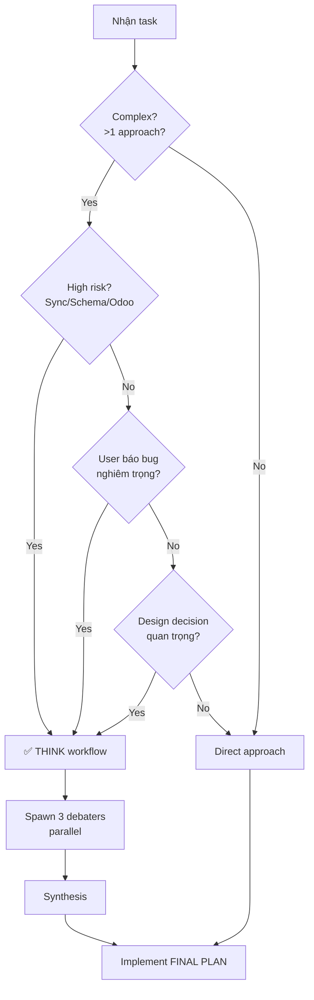

# THINK Workflow - Multi-agent Debate Pattern

> **Dành cho:** Zed AI Agent (sử dụng `spawn_agent` tool)
> **Version:** 1.0
> **Updated:** 2026-08-05

---

## 🎯 Mục đích

THINK workflow là pattern **tự phản biện** bằng cách spawn 3 subagents tranh luận với nhau:
- **PROPOSER**: Đề xuất giải pháp đơn giản nhất
- **SKEPTIC**: Tấn công đề xuất, tìm lỗ hổng
- **CHECKER**: Verify bằng code thực tế

→ Main agent tổng hợp → **FINAL PLAN** đã được kiểm chứng

---

## ⚡ Khi nào BẮT BUỘC dùng THINK

**Trigger tự động khi có BẤT KỲ dấu hiệu nào sau:**

### 1. Task phức tạp, >1 cách tiếp cận
- VD: "Implement recurring feature" có thể: template-based, rule-based, hoặc cron-style
- VD: "Refactor sync logic" có thể: keep current + patch, hoặc rewrite từ đầu

### 2. Rủi ro cao: đụng sync/Odoo/schema
- Thay đổi Isar model (migration risk)
- Sửa sync logic (conflict Odoo vs local)
- Thay đổi Odoo API calls (schema mismatch)

### 3. User báo bug nghiêm trọng hoặc hỏi "có bug không?"
- VD: "service_type field bị mất, checklist không load"
- VD: "Sync completed order có đúng không?"
→ SKEPTIC + CHECKER verify bug thực sự tồn tại hay không

### 4. Design decision quan trọng
- Chọn architecture pattern (offline-first, state management...)
- Database schema changes
- Breaking changes với backend

**❌ KHÔNG dùng THINK khi:**
- Task đơn giản, rõ ràng (<3 files, no risk)
- Đã có FINAL PLAN từ THINK workflow trước đó (chỉ implement)
- Fix typo, refactor nhỏ, thêm UI component đơn giản

---

## 📋 THINK Workflow Steps

### Step 1: Main agent nhận diện trigger

```markdown
VD: User yêu cầu "Implement recurring feature"
→ Main agent: "Task phức tạp + rủi ro schema → Cần THINK workflow"
```

### Step 2: Spawn 3 debaters song song

**QUAN TRỌNG:** Spawn cả 3 cùng lúc (parallel calls) để tối ưu thời gian.

**Template message cho PROPOSER:**
```
Role: PROPOSER

Problem: [brief problem statement]

Context:
- Project: Flutter Field Force app với Odoo FSM backend
- Tech stack: Flutter + Isar DB (offline-first) + odoo_rpc package
- Constraints: [specific constraints từ AGENTS.md nếu có]

Your task: Đề xuất giải pháp ĐỠN GIẢN NHẤT, khả thi nhất.

Output format (200 words max):
CLAIM | [solution description]
EVIDENCE | [file:line references supporting claim]
RISK | [potential issues]
```

**Template message cho SKEPTIC:**
```
Role: SKEPTIC

Problem: [same problem]

Context: [same context]

Your task: TẤN CÔNG đề xuất, tìm LỖ HỔNG.

Focus areas:
- Offline mode implications (sync conflict?)
- Odoo schema mismatches (field names?)
- Edge cases (null, empty, concurrent edits)
- Performance issues (N+1 queries, large data)

Output format (200 words max):
CLAIM | [counter-argument]
EVIDENCE | [file:line or AGENTS.md rule references]
RISK | [why approach fails]
```

**Template message cho CHECKER:**
```
Role: CHECKER

Problem: [same problem]

Context: [same context]

Your task: VERIFY bằng CODE THỰC TẾ. Dùng grep/read_file để đọc code, KHÔNG tin assumptions.

Output format (200 words max):
CLAIM | [validation result]
EVIDENCE | [file:line code evidence ONLY - paste actual code snippets]
RISK | [confirmed/denied risks from PROPOSER + SKEPTIC]
```

### Step 3: Main agent đợi cả 3 responses, tổng hợp

**Fixed Format Synthesis:**

```markdown
## THINK WORKFLOW RESULTS

### PROPOSER
[paste PROPOSER output]

### SKEPTIC
[paste SKEPTIC output]

### CHECKER
[paste CHECKER output]

---

### SYNTHESIS

AGREE | [nếu cả 3 đồng thuận]
CONFLICT | [PROPOSER vs SKEPTIC points nếu có mâu thuẫn]
FINAL PLAN | [resolved approach + files to modify]

Decision: [Chọn approach nào, lý do vì sao]
```

### Step 4: Main agent implement theo FINAL PLAN

---

## 🎭 Chi tiết vai trò từng Debater

### PROPOSER (Người đề xuất)
**Goal**: Giải pháp đơn giản nhất, khả thi nhất  
**Style**: Lạc quan, pragmatic  
**Output**: 200 words max

**Ví dụ PROPOSER output:**
```
CLAIM | Thêm recurring fields vào FsmOrder model (recurringRule, interval, nextOccurrence)
EVIDENCE | 
- lib/features/orders/models/fsm_order.dart:15 — đã có Id, odooId pattern
- Similar pattern: routeId, routeSequence (lines 49-51)
RISK | 
- Isar migration cần rebuild DB
- FsmOrder.fromJson phải handle null/false từ Odoo
```

### SKEPTIC (Người hoài nghi)
**Goal**: Tấn công đề xuất, tìm edge cases  
**Style**: Bi quan, critical  
**Focus**: offline mode, sync conflicts, schema mismatches, edge cases

**Ví dụ SKEPTIC output:**
```
CLAIM | PROPOSER approach bỏ qua sync conflict: local nextOccurrence vs Odoo
EVIDENCE |
- AGENTS.md §6: "Odoo là source of truth" — local calculate nextOccurrence có thể sai
- orders_service.dart:172 — fetch từ Odoo, không có merge logic
RISK |
- User skip occurrence local, Odoo vẫn generate → duplicate orders
- Recurring rule update trên Odoo không sync xuống app realtime
```

### CHECKER (Người kiểm chứng)
**Goal**: Verify bằng code thực tế  
**Style**: Objective, chỉ tin bằng chứng  
**Method**: Đọc code thực tế (grep, read_file), KHÔNG tin assumptions

**Ví dụ CHECKER output:**
```
CLAIM | Verify PROPOSER + SKEPTIC claims bằng code
EVIDENCE |
- FsmOrder model hiện tại: 64 lines, có isPendingSync + lastSyncAt (lines 59-60)
- orders_service.dart:172 — dùng search_read với _fields list, không có merge logic
- sync_manager.dart:63 — có registerSyncHandler pattern, push changes lên Odoo
RISK CONFIRMED |
- SKEPTIC đúng: không có merge logic, Odoo wins mọi conflict (line 280 override local)
- PROPOSER risk đúng: FsmOrder.fromJson cần handle null (line 68 pattern _strOrNull)
```

---

## ✅ Ví dụ thực tế từ project (Session 2026-08-04)

**Problem**: User báo recurring feature "tào lao", cần implement lại

**THINK Workflow Results**:
- **PROPOSER** (failed 503) — không có output
- **SKEPTIC** — phát hiện 5 bugs tiềm ẩn (service_type, sync logic, notification...)
- **CHECKER** — verify code thực tế:
  - Bug #1 (service_type): KHÔNG TỒN TẠI, report sai
  - Bug #2-3 (sync): ĐÃ FIX đúng (action_complete + try-catch)
  - Bug #4-5: Files không tồn tại, không áp dụng

**SYNTHESIS**:
```
CONFLICT | SKEPTIC báo 5 bugs, CHECKER verify chỉ còn 0 bugs thực sự
FINAL PLAN | 
1. Không fix bugs (đã được fix hoặc không tồn tại)
2. Focus implement recurring từ đầu:
   - Verify Odoo backend support (CP0)
   - Design data model (CP1)
   - Implement core logic (CP2)
Decision: Approach 2 (implement đúng chuẩn) thay vì patch bugs mock
```

**Bài học**:
- SKEPTIC có thể "quá bi quan" → CHECKER cần verify
- Không có PROPOSER vẫn ra quyết định được (2/3 debaters OK)
- Main agent phải verify lại critical findings (không tin 100% subagent)

---

## 🚨 Error Handling

### 1. Subagent timeout/fail (1 hoặc 2 debaters chết)

**Nếu PROPOSER fail:**
→ Dùng SKEPTIC + CHECKER, main agent tự đề xuất approach

**Nếu SKEPTIC fail:**
→ Dùng PROPOSER + CHECKER, nhưng thêm line "RISKS UNVERIFIED"

**Nếu CHECKER fail:**
→ Dùng PROPOSER + SKEPTIC, nhưng thêm line "EVIDENCE UNVERIFIED"

**Nếu ≥2 debaters fail:**
→ Main agent tự phân tích, không dùng THINK (fallback to direct approach)

### 2. Debaters mâu thuẫn hoàn toàn

VD: PROPOSER đề xuất A, SKEPTIC bác bỏ hoàn toàn A, CHECKER không kết luận

**Main agent synthesis:**
```
CONFLICT | [liệt kê mâu thuẫn]
RESOLUTION | [main agent chọn approach dựa trên:
  - Alignment với AGENTS.md rules
  - Alignment với project architecture
  - Risk vs benefit tradeoff]
FINAL PLAN | [chosen approach]
```

---

## 💡 Best Practices

### 1. Message cho debaters phải ngắn gọn, focused

✅ **ĐÚNG:**
```
Problem: Implement recurring tasks
Context: Flutter app + Odoo FSM + Isar offline
Constraints: Odoo là source of truth, offline-first
Your role: PROPOSER — đề xuất approach đơn giản nhất
```

❌ **SAI:**
```
User muốn recurring feature, hiện tại code tào lao, có nhiều bugs...
[paste 500 lines context]
Hãy suy nghĩ và đề xuất...
```

### 2. Không paste toàn bộ code vào prompt

- Debaters tự grep/read_file khi cần
- Chỉ give brief context (architecture, tech stack, constraints)

### 3. Synthesis phải decisive

❌ **SAI:** "Cả 3 approaches đều OK, tùy user chọn"

✅ **ĐÚNG:** 
```
FINAL PLAN: Approach B (template-based) vì:
- Align với Odoo backend pattern (CHECKER verified)
- Tránh sync conflict (SKEPTIC concern addressed)
- Simplest implementation (PROPOSER goal)
```

### 4. Document THINK results

- Lưu synthesis vào checkpoint docs (như CP0 đã làm)
- Ghi rõ decision rationale cho AI phiên sau

---

## 📊 THINK vs Direct Approach - Decision Tree



---

## 🔗 Tham khảo thêm

- **AGENTS.md §13**: Khi nào dùng spawn_agent (general delegation guideline)
- **PROGRESS.md**: Session logs có THINK workflow results
- **Checkpoint docs** (02_PRE_REQS.md, 03_DATA_MODEL.md): Lưu THINK synthesis cho context
