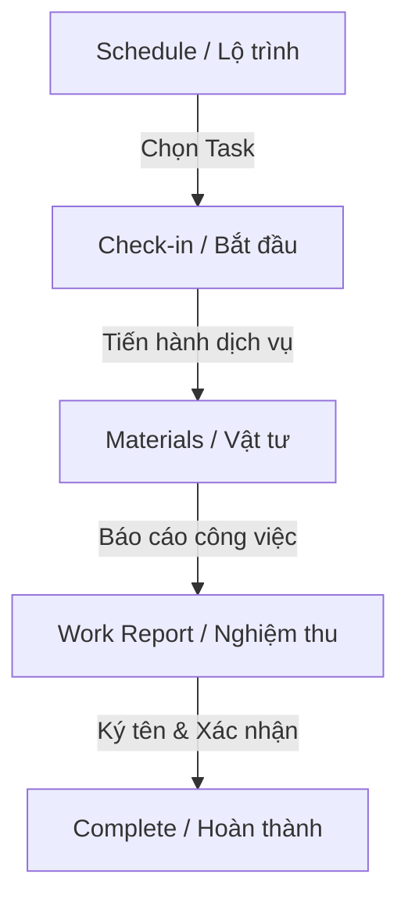

# FSM Business Flow Skill

Mô tả các luồng nghiệp vụ FSM thực tế của nhân viên thực địa (Worker) khi sử dụng ứng dụng di động `fieldforce_mobile`.

## Luồng Quy Trình Nghiệp Vụ Chuẩn (FSM Workflow)

### 1. Schedule (Lịch biểu & Lộ trình)
- Nhân viên thực địa mở màn hình danh sách đơn FSM được phân công (được sắp xếp theo thứ tự tối ưu `routeSequence` từ Odoo).
- Dữ liệu hiển thị từ offline database (`FsmOrder`).

### 2. Check-in (Bắt đầu công việc)
- Worker thực hiện check-in khi đến hiện trường.
- App lấy tọa độ GPS hiện tại (`geolocator`) và gửi sự kiện bắt đầu công việc lên Odoo/lưu offline kèm thời gian `dateStart`.
- Chuyển stage của đơn FSM sang `inProgress`.

### 3. Materials (Tiêu hao vật tư)
- Cho phép quét mã vạch sản phẩm/linh kiện bằng camera (`mobile_scanner`).
- Lưu trữ lượng tiêu hao vật tư local (`StockMove` với `isPendingSync = true`) và update tồn kho ảo của Worker.

### 4. Work Report & Chữ ký (Nghiệm thu)
- Ghi nhận mô tả công việc hoàn thành (`workDone`), các vấn đề phát hiện (`problemsFound`).
- Chụp ảnh hiện trường nghiệm thu (`image_picker`).
- Lấy chữ ký điện tử trực tiếp từ khách hàng (`signature`).

### 5. Complete (Hoàn thành)
- Bấm gửi nghiệm thu. Nếu online, dữ liệu báo cáo, ảnh và chữ ký sẽ được đẩy tức thời lên Odoo thông qua RPC. Nếu offline, dữ liệu được ghi vào `WorkReport` local chờ `SyncManager` đồng bộ sau.
- Cập nhật trạng thái Task thành `done`.
